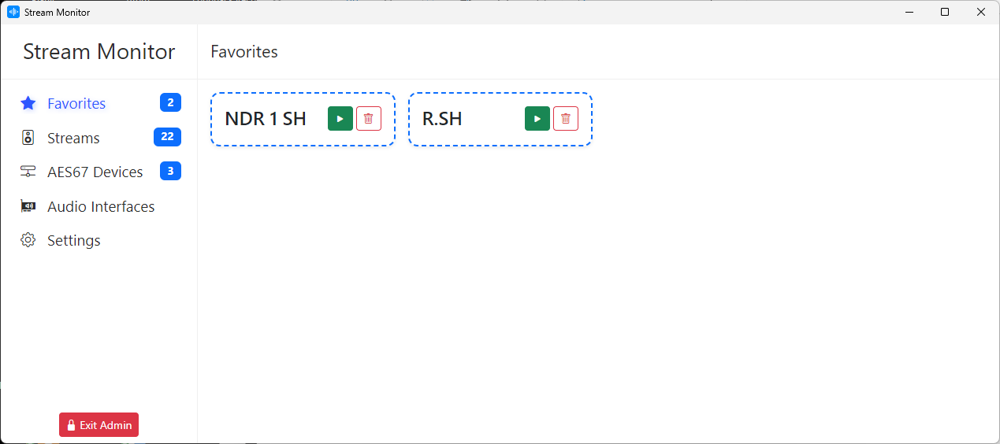
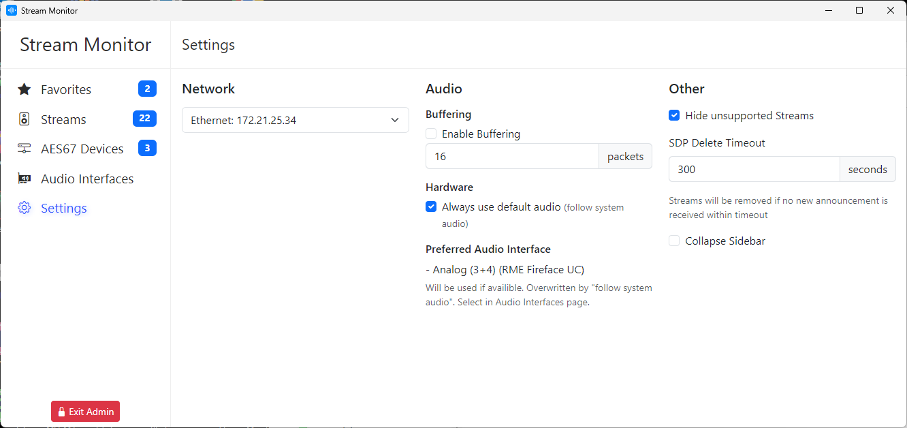

# AES67 Stream Monitor

[](https://github.com/stoeckenm/aes67-monitor)
[](https://github.com/stoeckenm/aes67-monitor?tab=MIT-1-ov-file)
[](https://github.com/stoeckenm/aes67-monitor/releases/latest)

AES67 Stream Monitor ist eine plattformübergreifende Audio-over-IP-Monitoring-Anwendung, konzipiert für Live-Sound, Studio- und Broadcast-Umgebungen. Getestet mit AES67-kompatibler Dante-Hardware, bietet die Anwendung umfassende Funktionen zur Verwaltung und Analyse von Audio-over-IP-Streams:

- **Extensive Format Support:** Unterstützt die volle Bandbreite der Audioformate, wie in den AES67-, RAVENNA- und ST 2110-30-Standards definiert. Dies umfasst unkomprimiertes L16- und L24-PCM-Audio über bis zu 64 Kanäle, verschiedene Abtastraten (48000Hz, 96000Hz und mehr) und alle durch die Standards spezifizierten Paketzeiten, abhängig von den Fähigkeiten Ihrer Soundkarte.
- **Automatische Erkennung & Manuelle Streams:** Erkennt AES67-Streams automatisch über das Session Announcement Protocol (SAP). Manuelles Hinzufügen von Streams ist zusätzlich durch direkte Eingabe von Raw-SDP-Daten möglich.
- **Stream-Filterung und -Sortierung:** Einfaches Filtern und Sortieren von Streams, um schnell die benötigten Kanäle zu finden.
- **Selektives Channel Listening:** Auswahl spezifischer Kanäle zum Abhören, mit Unterstützung für Stereo-Paare und individuelle Mono-Kanäle.
- **Konfigurierbare Systemschnittstellen:**
  - **Netzwerk:** Konfigurierbare Netzwerkschnittstellen für Stream-Empfang und SAP-Erkennung.
  - **Audio:** Auswahl spezifischer Audio-Schnittstellen und Konfiguration der **RTP-Pufferung** (Jitter Buffer), um die Stabilität bei Netzwerkproblemen zu erhöhen.
- **Folge System-Audio:** Möglichkeit, eine spezifische Audio-Ausgabe festzulegen oder der System-Audioausgabe zu folgen.
- **Admin Mode:** Optionale Ausblendung aller Einstellungen, wenn der Admin-Modus deaktiviert ist.
- **Favoriten-Verwaltung:** Eine spezielle Seite zum Hinzufügen und Verwalten von Streams mit benutzerfreundlichen Namen (`Friendly Names`).
- **Datenpersistenz:** Getrennte Speicherung von **maschinenspezifischen Einstellungen** (`persistentData`) und **benutzerspezifischen UI-Einstellungen** (`userData`).

---

## ⚙️ Architektur & Entwicklungshinweise (Neu)

Die Anwendung basiert auf Electron, wobei die kritischen Prozesse für AES67-Netzwerkerkennung (`sdp.js`) und Audio-Wiedergabe (`audio.js`) über **Node.js Child Processes** (`child_process.fork`) isoliert wurden, um die Stabilität des Hauptprozesses zu gewährleisten.

Die Backend-Logik ist in folgende Module unterteilt:

- **`system/`**: Enthält die Kernlogik für die Interaktion mit dem Betriebssystem, einschließlich Netzwerkschnittstellen-Management und `audify`/`RtAudio`-Initialisierung.
- **`persistence/`**: Verwaltet das asynchrone, atomare Speichern und Laden der Konfigurationsdaten (`persistentData` und `userData`).
- **`ipc/`**: Definiert die Kommunikation (Inter-Process Communication) zwischen dem Electron Renderer Process (Frontend) und dem Electron Main Process.

---

## 📸 Screenshots

Below are some screenshots showcasing the application's interface:





## Installation

See the [lastest release](https://github.com/philhartung/aes67-monitor/releases/latest) for ready-to-use binaries for MacOS, Windows and Linux. Please note that the binaries are currently not signed.

## Installation and Building from source

```

git clone [https://github.com/philhartung/aes67-monitor.git](https://github.com/philhartung/aes67-monitor.git)
cd aes67-monitor
npm install

```

This installs all dependencies for your platform. **Audify** (das verwendete Audio-Backend auf Basis von RtAudio) prebuilds sind für die meisten wichtigen Plattformen und NodeJS-Versionen verfügbar. Sollten native Module fehlschlagen, siehe [Build Audify from Source](https://github.com/almoghamdani/audify#requirements-for-source-build).

Nach einer erfolgreichen Installation, erstellen Sie das Binary für Ihr System durch Ausführen von:

```

npm run build

```

Dies erstellt die Binaries für die aktuelle Plattform (MacOS, Windows, Linux).

## Development

### Compiles and hot-reloads frontend for development

```

npm run serve

```

### Start electron for development

You will have to run `npm run serve` too for the frontend.

```

npm start

```

### Lint and format files

```

npm run lint
npm run format

```

## Testing

New releases of the AES67 Stream Monitor are tested using both AES67-compliant hardware and software to ensure reliable stream discovery and accurate audio playback. Testing is primarily conducted on macOS, with additional testing performed on Windows. Furthermore, new releases may be tested by [partners](#partners) on various hardware and platforms.

### Hardware

The following hardware devices are used during testing:

| Manufacturer | Device                       | AoIP Protocol        | Discovery                                            | Codec | Sample Rate | Channels per Stream | Packet Time |
| :----------- | :--------------------------- | :------------------- | :--------------------------------------------------- | :---- | :---------- | :------------------ | :---------- |
| Audinate     | AVIO USB-C                   | AES67 (Dante flavor) | [SAP](https://datatracker.ietf.org/doc/html/rfc2974) | L24   | 48 kHz      | 1 – 2               | 1 ms        |
| Behringer    | WING Compact w/ Dante Module | AES67 (Dante flavor) | [SAP](https://datatracker.ietf.org/doc/html/rfc2974) | L24   | 48 kHz      | 1 – 8               | 1 ms        |
| Blackmagic   | 2110 IP Mini BiDirect 12G    | ST 2110-30           | [NMOS](https://specs.amwa.tv/nmos/)                  | L24   | 48 kHz      | 2 – 16              | 0.125 ms    |

### Software-Generated Streams

GStreamer is used to generate AES67-compliant RTP streams with the following configurations:

| Codec | Sample Rate | Channels | Packet Time |
| :---- | :---------- | :------- | :---------- |
| L16   | 44.1 kHz    | 1        | 1 ms        |
| L16   | 44.1 kHz    | 8        | 1 ms        |
| L16   | 48 kHz      | 1        | 0.125 ms    |
| L16   | 48 kHz      | 1        | 1 ms        |
| L16   | 48 kHz      | 2        | 4 ms        |
| L16   | 48 kHz      | 4        | 2 ms        |
| L16   | 48 kHz      | 8        | 0.125 ms    |
| L16   | 48 kHz      | 8        | 1 ms        |
| L16   | 48 kHz      | 64       | 0.125 ms    |
| L16   | 96 kHz      | 1        | 0.125 ms    |
| L16   | 96 kHz      | 1        | 1 ms        |
| L16   | 96 kHz      | 4        | 1 ms        |
| L16   | 96 kHz      | 8        | 0.125 ms    |
| L16   | 96 kHz      | 32       | 0.125 ms    |
| L24   | 44.1 kHz    | 1        | 1 ms        |
| L24   | 44.1 kHz    | 8        | 1 ms        |
| L24   | 48 kHz      | 1        | 0.125 ms    |
| L24   | 48 kHz      | 1        | 1 ms        |
| L24   | 48 kHz      | 2        | 4 ms        |
| L24   | 48 kHz      | 4        | 2 ms        |
| L24   | 48 kHz      | 8        | 0.125 ms    |
| L24   | 48 kHz      | 8        | 1 ms        |
| L24   | 48 kHz      | 64       | 0.125 ms    |
| L24   | 96 kHz      | 1        | 0.125 ms    |
| L24   | 96 kHz      | 1        | 1 ms        |
| L24   | 96 kHz      | 4        | 1 ms        |
| L24   | 96 kHz      | 8        | 0.125 ms    |
| L24   | 96 kHz      | 32       | 0.125 ms    |

For details on the software testing implementation and SDP files, please refer to [philhartung/aoip-tester](https://github.com/philhartung/aoip-tester).

## Partners

This section is dedicated to partners supporting the development of AES67 Stream Monitor. Partners listed here provide resources that help advance the project in various ways. This may include testing new releases on AoIP hardware by the partner, supplying hardware for testing, or offering financial support for new features or the general development of AES67 Stream Monitor. Partners are essential to ensure that AES67 Stream Monitor works as expected and to provide critical feedback on which features are needed for wider adoption.

Partners receive higher priority for bug reports & feature requests, are provided early access builds and are listed in this section. Partners also have a direct channel of communication and receive feedback on any hardware they provide for testing. If you're interested in becoming a partner, feel free to reach out via email at partners [at] aes67.app.

### Current Project Partners

| Partner                                                                                                                                                                                                                                                                                                                       | Type of Partnership | Description                                                                                                                                                                                                                                |
| :---------------------------------------------------------------------------------------------------------------------------------------------------------------------------------------------------------------------------------------------------------------------------------------------------------------------------- | :------------------ | :----------------------------------------------------------------------------------------------------------------------------------------------------------------------------------------------------------------------------------------- |
| <a href="https://hochschulradio-aachen.de"><picture><source media="(prefers-color-scheme: dark)" srcset=".doc/logo-hochschulradio-light.png"><source media="(prefers-color-scheme: light)" srcset=".doc/logo-hochschulradio-dark.png"></picture></a> | Testing & Feedback  | RWTH Aachen University's campus radio station is a founding partner and has played a key role since the beginning of the project. Every new release is tested on their hybrid Dante / AES67 network in a real-world broadcast environment. |
